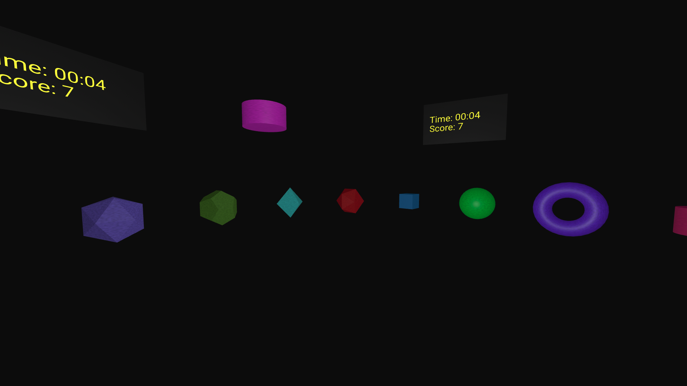

# A-Frame Reflexes

## About

A-Frame Reflexes is a game built with [A-Frame](https://aframe.io/) that relies on the user's speed, memory, and reflexes in order to get a high score.

In the game, the user is surrounded by various colored shapes. The goal is to click the shape which corresponds to the floating reference shape. Each shape the user correctly clicks adds +1 to their score. At the end of each round, the player is shown their score, high score, and number of incorrect clicks.

## Playing the Game

You can play A-Frame Reflexes [here](https://techpandapro.github.io/a-frame-reflexes/)!
